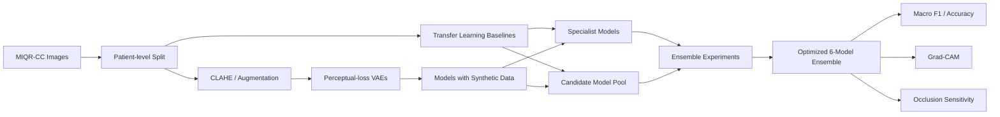
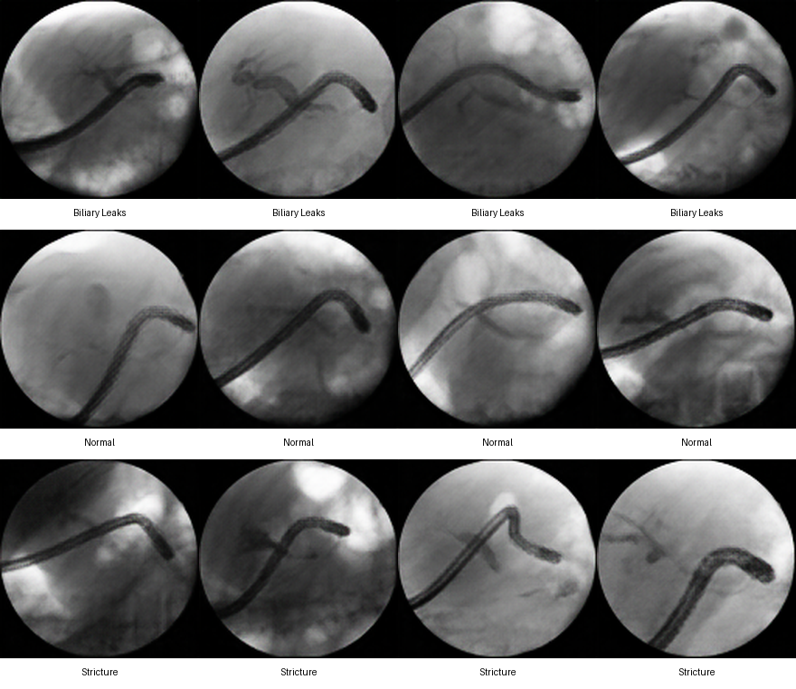
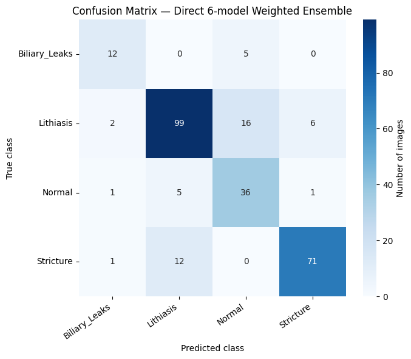
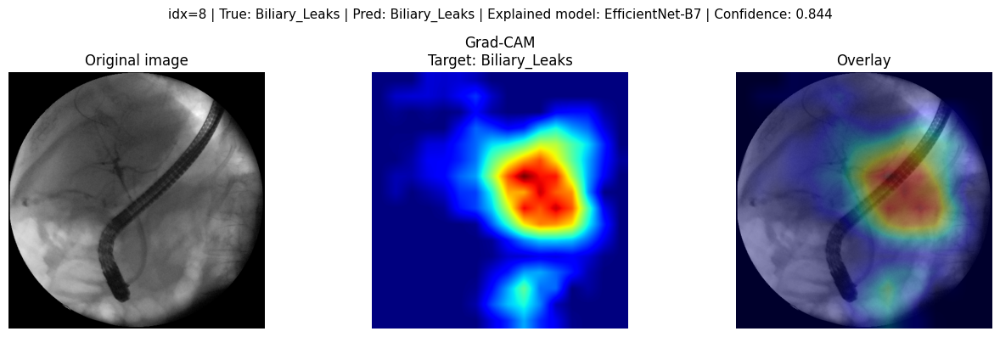
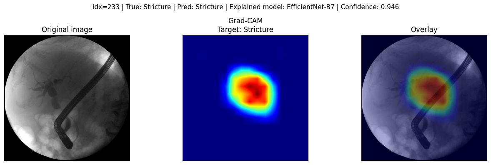

<div align="center">

# ERCP Fluoroscopy Deep Learning

### Leakage-aware medical image classification with synthetic augmentation, specialist models and ensemble learning


</div>

---

## Overview

This project develops a **computer-aided diagnosis (CADx) pipeline for 4-class ERCP fluoroscopy classification** using the **MIQR-CC** dataset.

Rather than stopping at a single transfer-learning model, the work explores the full modelling pipeline:

- patient-level data splitting to prevent leakage;
- CNN and Vision Transformer baselines;
- architecture and fine-tuning experiments;
- CLAHE-based preprocessing;
- **Variational Autoencoders (VAEs)** for minority-class augmentation;
- class-specific specialist models;
- validation-driven ensemble optimization;
- **Grad-CAM and Occlusion Sensitivity** for model interpretation.

The final system is a **direct weighted ensemble of six neural networks**.

### Final Test Performance

| Metric | Result |
|---|---:|
| **Macro F1** | **0.7881** |
| **Accuracy** | **81.65%** |
| Classes | 4 |
| Test images | 267 |
| Ensemble components | 6 |

The final ensemble improves substantially over the project's initial EfficientNet-B7 baseline (**Macro F1 0.6721**) while maintaining a patient-independent test set.

---

## Clinical Classification Task

The model predicts one of four ERCP findings:

| Class | Description |
|---|---|
| **Biliary Leaks** | Contrast leakage from the biliary system |
| **Lithiasis** | Biliary stones |
| **Normal** | No target pathological finding |
| **Stricture** | Benign and malignant strictures grouped into one class |

The objective is not clinical deployment. The project is a research/educational benchmark for AI-assisted interpretation of fluoroscopic ERCP images.

---

## System Development



The project contains **34 experiment notebooks**, documenting the path from baseline models to the final system.

---

## Data and Leakage Control

MIQR-CC is a public, expert-annotated ERCP fluoroscopy dataset containing **1,602 patients**, **19,018 raw images**, **19,317 processed images** and **5,519 labelled images**.

The experiments in this repository use a filtered subset of **1,568 labelled images from 436 patients**.

### Patient-Level Split

| Split | Patients | Biliary Leaks | Lithiasis | Normal | Stricture | Images |
|---|---:|---:|---:|---:|---:|---:|
| Train | 305 | 110 | 505 | 197 | 255 | 1,067 |
| Validation | 65 | 24 | 98 | 59 | 53 | 234 |
| Test | 66 | 17 | 123 | 43 | 84 | 267 |

All images belonging to the same patient remain in the same split:

\[
P_{\mathrm{train}}\cap P_{\mathrm{val}} =
P_{\mathrm{train}}\cap P_{\mathrm{test}} =
P_{\mathrm{val}}\cap P_{\mathrm{test}} = \varnothing
\]

This is a central design choice: an image-level random split could leak highly related frames from the same patient into both training and evaluation data.

The complete image dataset is intentionally **not duplicated in this Git repository**.  
`data/split_manifest.csv` preserves the exact split used in the experiments.

---

## Modelling Strategy

### 1. Baselines and Architecture Exploration

The project evaluates several transfer-learning families:

- **ResNet** — 18, 34 and 50
- **DenseNet121**
- **MobileNetV2**
- **EfficientNet** — B0, B3, B5, B7 and V2-S
- **ConvNeXt**
- **DeiT-III**
- **Swin Transformer**

The broad model search was used to study the trade-offs between convolutional architectures, efficient mobile networks and transformer-based image models.

### 2. Synthetic Data with VAEs

Class imbalance was addressed experimentally with convolutional **Variational Autoencoders using perceptual loss**.

The archived generation pipeline produced:

- 300 synthetic **Biliary Leaks** images;
- 300 synthetic **Normal** images;
- 300 synthetic **Stricture** images.

<p align="center">
  
</p>

Synthetic data were then evaluated in downstream classifiers including ConvNeXt-Tiny, EfficientNet-B0 and SwinV2.

### 3. Specialist Models

The project also investigates class-specific correction strategies for difficult errors:

- a **Biliary Leaks specialist**;
- an improved Biliary Leaks specialist;
- a **Stricture-vs-Lithiasis specialist**.

This led to a hierarchical-equivalent system reaching **0.7868 test Macro F1** before the final direct ensemble was selected.

### 4. Optimized Ensemble

The final prediction is:

\[
P_{\text{final}}(y\mid x)
=
\sum_{m=1}^{6} w_m P_m(y\mid x),
\qquad
\sum_{m=1}^{6}w_m = 1
\]

with weights selected using **validation Macro F1 only**.

| Model | Weight | Test Macro F1 as standalone component |
|---|---:|---:|
| EfficientNet-B7 | 0.3722 | 0.7439 |
| ConvNeXt-Tiny + VAE | 0.3064 | 0.7434 |
| MobileNetV2 | 0.1791 | 0.5578 |
| EfficientNet-B0 + VAE | 0.1380 | 0.6492 |
| ResNet50 | 0.0038 | 0.7359 |
| DenseNet121 | 0.0006 | 0.6665 |

The weights show an important point: the final system is not a simple majority vote. Validation-driven optimization concentrates most probability mass on EfficientNet-B7 and ConvNeXt-Tiny while preserving smaller complementary contributions from other models.

---

## Final Results

### Aggregate Performance

| Split | Accuracy | Macro F1 |
|---|---:|---:|
| Validation | 75.21% | 0.7136 |
| **Test** | **81.65%** | **0.7881** |

### Test Performance by Class

| Class | Precision | Recall | F1 | Support |
|---|---:|---:|---:|---:|
| Biliary Leaks | 0.7500 | 0.7059 | 0.7273 | 17 |
| Lithiasis | 0.8534 | 0.8049 | 0.8285 | 123 |
| Normal | 0.6316 | 0.8372 | 0.7200 | 43 |
| Stricture | 0.9103 | 0.8452 | 0.8765 | 84 |

<p align="center">
  
</p>

The use of **Macro F1** is deliberate because the four classes are strongly imbalanced, particularly Biliary Leaks.

---

## Interpretability

The final pipeline includes two complementary post-hoc interpretation methods:

- **Grad-CAM** — highlights spatial regions associated with the network's class evidence;
- **Occlusion Sensitivity** — measures how predictions change when local image regions are masked.

Example — correctly classified Biliary Leaks:

<p align="center">
  
</p>

Example — correctly classified Stricture:

<p align="center">
  
</p>

Additional Grad-CAM and occlusion examples, including a misclassified case, are available under `assets/interpretability/`.

Interpretability is used here as a **model-inspection tool**, not as evidence of clinical validity.

---

## Repository Structure

```text
ercp-fluoroscopy-deep-learning/
├── README.md
├── requirements.txt
│
├── notebooks/
│   ├── 01_data/
│   ├── 02_baselines/
│   ├── 03_architectures/
│   ├── 04_augmentation/
│   ├── 05_feature_experiments/
│   ├── 06_specialists/
│   └── 07_ensemble/
│
├── data/
│   ├── README.md
│   └── split_manifest.csv
│
├── models/
│   ├── README.md
│   └── checkpoint_manifest.csv
│
├── results/
│   ├── dataset_split_summary.csv
│   ├── ensemble_component_metrics.csv
│   ├── ensemble_weights.csv
│   ├── final_class_metrics.csv
│   ├── final_ensemble_config.json
│   └── final_ensemble_metrics.csv
│
├── assets/
│   ├── final_confusion_matrix.png
│   ├── vae_synthetic_samples.png
│   ├── interpretability/
│   ├── model_runs/
│   └── vae_samples/
│
├── docs/
│   ├── EXPERIMENTS.md
│   └── project_report.pdf
│
└── environment/
    └── ensemble_requirements_snapshot.txt
```

See [`docs/EXPERIMENTS.md`](./docs/EXPERIMENTS.md) for the experiment catalogue.

---

## Reproducing the Experiments

### 1. Clone

```bash
git clone https://github.com/martim-q-pfelix23/ercp-fluoroscopy-deep-learning.git
cd ercp-fluoroscopy-deep-learning
```

### 2. Environment

```bash
python -m venv .venv
source .venv/bin/activate       # Linux / macOS
# .venv\Scripts\activate        # Windows

pip install -r requirements.txt
```

GPU acceleration with CUDA is strongly recommended.

### 3. Download MIQR-CC

Dataset:

https://doi.org/10.6084/m9.figshare.31079236

The repository does not redistribute the full dataset. Use `data/split_manifest.csv` to reconstruct the exact archived split.

### 4. Run the pipeline

Start with:

```text
notebooks/01_data/patient_level_split.ipynb
```

Then explore the modelling stages in numerical order. The final system is:

```text
notebooks/07_ensemble/final_weighted_ensemble.ipynb
```

---

## Model Checkpoints

The final ensemble requires six trained checkpoints.

The GitHub source archive used to prepare this portfolio version contained **Git LFS pointer files rather than the checkpoint binaries themselves**. For transparency, `models/checkpoint_manifest.csv` stores the original LFS object hashes and expected sizes.

For a public release, the preferred approach is to publish the final checkpoints through **Git LFS, GitHub Releases or a model registry**, rather than committing ~1 GB of binary weights into normal Git history.

The ensemble definition itself is fully preserved in:

```text
results/final_ensemble_config.json
results/ensemble_weights.csv
```

---

## Dataset Attribution

This project uses the **MIQR-CC Dataset**:

> Andrade, A. J., Martins, M., Ferreira, A., Araújo, T., Lopes, L. & Alves, V.  
> *Curated endoscopic retrograde cholangiopancreatography images dataset.*  
> Scientific Data, 2026.  
> https://doi.org/10.1038/s41597-026-07679-1

Dataset: https://doi.org/10.6084/m9.figshare.31079236  
Original code repository: https://github.com/monicaccmartins/MIQR-CC-Dataset

MIQR-CC data are distributed under **CC BY 4.0**. Dataset ownership and attribution remain with the original authors.

---

## Limitations

- The experimental subset is imbalanced, with only 17 Biliary Leaks examples in the test set.
- Results are based on a single patient-level holdout rather than repeated cross-validation.
- Synthetic VAE images may not capture the full clinical distribution of minority classes.
- The optimized ensemble is considerably heavier than any single component model.
- Grad-CAM and occlusion maps are post-hoc explanations and do not establish causal or clinical interpretability.
- External validation on an independent clinical centre is required before making claims about generalisation.

---

## Academic Context

Developed as a group project for the **Deep Learning** course of the MSc in **Data Engineering and Data Science** at the **University of Minho** (2025/2026).

The full academic report is available in [`docs/project_report.pdf`](./docs/project_report.pdf).

---

## Disclaimer

This repository is intended for **research and educational purposes only**.  
The models are not clinically validated and must not be used for diagnosis or patient-care decisions.
