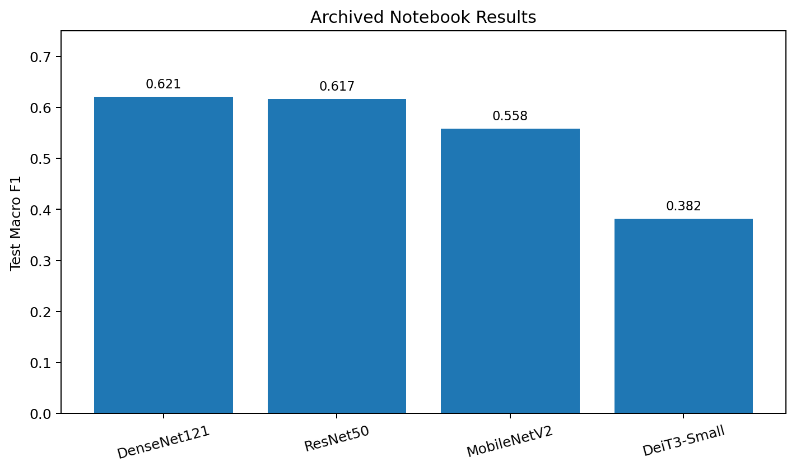

<div align="center">

# ERCP Image Classification with Deep Learning

**Patient-aware medical image classification on the MIQR-CC ERCP dataset**


</div>

---

## Overview

This project explores **deep learning for multi-class classification of ERCP fluoroscopy images** using the publicly available **MIQR-CC dataset**.

The goal is to distinguish four clinically relevant image classes:

- **Biliary Leaks**
- **Lithiasis**
- **Normal**
- **Stricture**

The project compares convolutional and transformer-based architectures under a common training pipeline, with particular attention to **patient-level data splitting**, **class imbalance** and **macro F1-score**.

> This repository is a machine-learning project built on the MIQR-CC dataset. It does **not** claim authorship of the dataset. Dataset and associated code attribution are provided below.

---

## Why This Problem Matters

ERCP is used in the diagnosis and treatment of biliary and pancreatic disease. Automated interpretation of fluoroscopic images is challenging because medical datasets are comparatively small, classes are imbalanced and multiple images can originate from the same patient.

A careless image-level split can therefore produce **patient leakage** and unrealistically optimistic evaluation results.

This project addresses that risk by assigning patients — rather than individual images — to train, validation and test partitions.

---

## Pipeline

```text
MIQR-CC Images
      │
      ▼
Image Preprocessing
      │
      ▼
Patient-Level Train / Validation / Test Split
      │
      ▼
Data Augmentation + Normalization
      │
      ▼
Transfer Learning
 ┌────┼────────┬────────────┬─────────────┬───────────┐
 ▼    ▼        ▼            ▼             ▼
ResNet DenseNet EfficientNet MobileNet    DeiT-III
 └────┴────────┴────────────┴─────────────┴───────────┘
      │
      ▼
Macro F1 + Accuracy + Class-wise Evaluation
```

---

## Dataset

The project uses the **MIQR-CC Dataset**, a curated ERCP fluoroscopy collection.

The complete public dataset contains:

- **1,602 patients**
- **19,018 raw images**
- **19,317 processed images**
- **5,519 expert-labelled images**

For the experiments archived in this repository, filtering to images marked for use and carrying a labelled target produced **1,568 images**.

### Experimental Split

Splitting is performed at the **patient level** using a 70/15/15 train-validation-test strategy.

| Split | Patients | Images |
|---|---:|---:|
| Train | 305 | 1,067 |
| Validation | 65 | 234 |
| Test | 66 | 267 |
| **Total** | **436** | **1,568** |

### Class Distribution

| Class | Train | Validation | Test | Total |
|---|---:|---:|---:|---:|
| Biliary Leaks | 110 | 24 | 17 | 151 |
| Lithiasis | 505 | 98 | 123 | 726 |
| Normal | 197 | 59 | 43 | 299 |
| Stricture | 255 | 53 | 84 | 392 |

The imbalance is one reason **macro F1** is used as a primary comparison metric rather than accuracy alone.

---

## Methodology

### Preprocessing

The preprocessing notebook demonstrates utilities for:

- vertical-line detection using Canny edges and the Hough transform;
- image segmentation using detected vertical boundaries;
- segment validation based on width, darkness and contrast;
- visual inspection of preprocessing results.

### Data Preparation

The split pipeline:

1. filters images marked `Keep`;
2. removes unlabelled observations;
3. merges benign and malignant stricture labels into a common **Stricture** class;
4. groups observations by patient;
5. creates non-overlapping train, validation and test patient sets;
6. verifies that no patient appears in more than one partition.

### Training Setup

All architectures use transfer learning with pretrained weights.

**CNN input resolution:** `512 × 512`  
**DeiT-III input resolution:** `384 × 384`  
**Batch size:** `4`  
**Optimizer:** Adam  
**Initial learning rate:** `1e-4`  
**Loss:** Focal Loss  
**Scheduler:** Cosine Annealing  
**Maximum epochs:** `60`  
**Early stopping patience:** `10`

Training augmentation includes random rotation, zoom, contrast adjustment and Gaussian noise.

### Architectures

- **ResNet50**
- **DenseNet121**
- **EfficientNet-B7**
- **MobileNetV2**
- **DeiT3-Small**

The selection covers different CNN design families together with a Vision Transformer architecture.

---

## Results

The table below contains metrics that are directly recoverable from the executed outputs stored in the archived notebooks.

| Model | Test Accuracy | Test Macro F1 | Best Validation Macro F1 |
|---|---:|---:|---:|
| **DenseNet121** | **65.9%** | **0.621** | **0.590** |
| ResNet50 | 63.7% | 0.617 | 0.490 |
| MobileNetV2 | 65.2% | 0.558 | 0.589 |
| DeiT3-Small | 55.1% | 0.382 | 0.513 |

<p align="center">
  
</p>

### Main Findings

- **DenseNet121** achieved the strongest macro F1 among the fully executed notebook runs stored here.
- **ResNet50** produced a similar macro F1 with a more balanced class-wise profile.
- **MobileNetV2** achieved competitive accuracy but a lower macro F1, illustrating why accuracy alone is insufficient under class imbalance.
- **DeiT3-Small** underperformed the CNN-based models in the archived run, especially on the minority Biliary Leaks class.
- Patient-level splitting is a central methodological choice because it prevents frames from the same patient leaking across evaluation partitions.

### EfficientNet-B7 Note

The archived EfficientNet-B7 notebook contains an interrupted training execution, so this README does **not** present an EfficientNet test score as a reproduced result.

For context, the published MIQR-CC data descriptor reports **78.3% test accuracy** and **0.738 macro F1** for its EfficientNet-B7 reference benchmark. That value is cited as an external benchmark, not as a metric recovered from the archived run in this repository.

---

## Repository Structure

```text
ercp-image-classification/
├── README.md
├── LICENSE
├── .gitignore
├── assets/
│   └── model-comparison.png
├── preprocessing/
│   ├── preprocessing.ipynb
│   ├── README.md
│   └── requirements.txt
├── training/
│   ├── patient_level_split.ipynb
│   ├── resnet50.ipynb
│   ├── densenet121.ipynb
│   ├── efficientnet_b7.ipynb
│   ├── mobilenet_v2.ipynb
│   ├── deit3_small.ipynb
│   ├── dataset/
│   │   └── README.md
│   ├── models/
│   │   └── README.md
│   ├── README.md
│   └── requirements.txt
└── results/
    └── model_metrics.csv
```

Large datasets and trained checkpoints are intentionally **not versioned in Git**.

---

## Reproducing the Project

### 1. Clone the repository

```bash
git clone https://github.com/<your-username>/ercp-image-classification.git
cd ercp-image-classification
```

### 2. Download MIQR-CC

Download the dataset from Figshare:

**https://doi.org/10.6084/m9.figshare.31079236**

The original data are not bundled with this repository.

### 3. Preprocessing environment

```bash
python -m venv .venv
source .venv/bin/activate   # Linux / macOS
pip install -r preprocessing/requirements.txt
```

Open:

```text
preprocessing/preprocessing.ipynb
```

### 4. Training environment

Install the training dependencies:

```bash
pip install -r training/requirements.txt
```

Run the patient-level split notebook first:

```text
training/patient_level_split.ipynb
```

Then run the desired architecture notebook from `training/`.

> GPU acceleration is strongly recommended for model training, especially for EfficientNet-B7 and DeiT3-Small.

---

## Reproducibility and Leakage Control

The most important reproducibility safeguard in this project is the **patient-level holdout strategy**.

All images associated with a given patient remain inside a single partition:

\[
P_{\text{train}} \cap P_{\text{val}} =
P_{\text{train}} \cap P_{\text{test}} =
P_{\text{val}} \cap P_{\text{test}} =
\varnothing
\]

This prevents highly related images from the same patient appearing in both training and evaluation sets.

Random seeds are also set in the training notebooks and early stopping is based on validation performance.

---

## Limitations

- The experimental subset is strongly class-imbalanced.
- Results are based on a single patient-level holdout split rather than repeated cross-validation.
- The model outputs are intended for research benchmarking and are **not clinically validated**.
- The archived EfficientNet-B7 training cell was interrupted and therefore its result is not reported as a reproduced experiment.
- External validation on data from other clinical centres would be required before making claims about generalisation.

---

## Dataset and Code Attribution

This project uses the **MIQR-CC Dataset** and builds on its publicly released preprocessing/training resources.

**Dataset:**  
A. J. Andrade, M. Martins, A. Ferreira, T. Araújo, L. Lopes and V. Alves, *Curated endoscopic retrograde cholangiopancreatography images dataset*, Scientific Data, 2026.

- Publication: https://www.nature.com/articles/s41597-026-07679-1
- Dataset: https://doi.org/10.6084/m9.figshare.31079236
- Original code: https://github.com/monicaccmartins/MIQR-CC-Dataset

The MIQR-CC dataset is distributed under **CC BY 4.0**. The code in this repository retains the existing **GNU GPL v3.0** license.

---

## Disclaimer

This repository is intended for **research and educational purposes only**. It is not a medical device and must not be used for clinical diagnosis or patient-care decisions.
